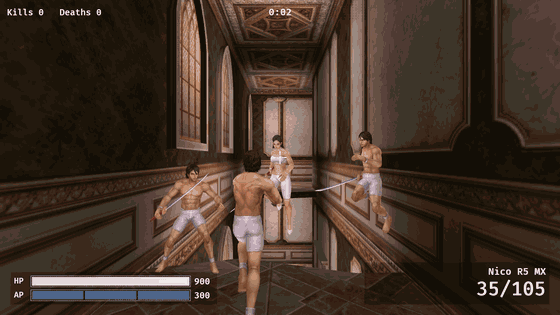

<div align="center">

# GunZRs

A clean-room Rust port of **GunZ: The Duel**, built on [Bevy](https://bevyengine.org).
It loads the maps, characters, weapons and effects straight from your Steam install.

[](https://www.rust-lang.org)
[](https://bevyengine.org)
[](LICENSE)
[](https://store.steampowered.com/app/3139440/GunZ_The_Duel/)



<sub>Mansion against three bots, recorded headlessly with <code>--shot</code> and <code>GUNZ_SEQ</code>.</sub>

</div>

No game files are included (the demo GIF is a capture for illustration). You need your own copy
of the game; the port only reads its `.mrs` archives and never runs `Gunz.exe`.

## Quick start

1. Install [GunZ: The Duel on Steam](https://store.steampowered.com/app/3139440/GunZ_The_Duel/)
   (or paste `steam://install/3139440` into your browser to open the Steam client).
2. Install [Rust](https://rustup.rs). On Linux, Bevy also needs the ALSA and udev development
   packages (`libasound2-dev libudev-dev` on Debian/Ubuntu, `alsa-lib-devel systemd-devel` on Fedora).
3. Build and play. `gunz-play` finds the game through Steam's library folders on its own; pass
   the install folder first if it lives somewhere unusual:

```sh
git clone https://github.com/OpenRsG/GunZRs && cd GunZRs
cargo run --release --bin gunz-play                       # main menu, game found via Steam
cargo run --release --bin gunz-play -- "/path/to/GUNZ THE DUEL"
```

| Steam install | `GAME` folder |
|---|---|
| Linux (native) | `~/.steam/steam/steamapps/common/GUNZ THE DUEL` |
| Linux (Flatpak) | `~/.var/app/com.valvesoftware.Steam/.local/share/Steam/steamapps/common/GUNZ THE DUEL` |
| Windows | `C:\Program Files (x86)\Steam\steamapps\common\GUNZ THE DUEL` |

Other library folder? In Steam, right-click the game, then Manage, Browse local files.
The port is developed and tested on Linux. A cross-check of the Windows target compiles, and CI
builds Linux, Windows and macOS, but nobody has played it on Windows or macOS yet.

## Controls

| Key | Action |
|---|---|
| Mouse | Aim (cursor is grabbed) |
| W A S D | Run; double-tap a direction to tumble |
| Space | Jump; near a wall in the air: wall kick; along a wall with W held: wall run |
| Left mouse | Attack (hold for automatic guns, chain slashes into a combo) |
| Right mouse | Guard (melee) |
| R | Reload |
| 1-5, wheel | Switch weapon |
| Tab | Scoreboard |
| Esc | Pause menu (resume, sensitivity, main menu, quit) |
| T, F5-F9 | Taunt, emotes (bow, wave, cry, laugh, dance) |
| F | Blitzkrieg upgrade panel (Up/Down, Enter buys) |
| M | Blitzkrieg minimap on / off |
| 1-9, arrows, Enter | Blitzkrieg class screen at the start of the match (30 s; click works too) |

Dead in a round mode? Space or click cycles the player you spectate.

Your profile (level, XP, bounty, inventory, equipped items) is saved in
`$XDG_DATA_HOME/gunzrs/profile.txt` (`%APPDATA%\gunzrs\profile.txt` on Windows). Kills and match
results pay XP and bounty; spend the bounty in the SHOP tab and equip items in INVENTORY.

## Status

### Working

| Area | What you get |
|---|---|
| Maps | All 30 RS v7 maps plus quest maps, with lightmaps, skies and every prop (fires, light shafts, water, fans, waving flags and curtains) |
| Collision | Retail `.RS.col` BSP: stairs, slopes, walls, ceilings |
| Characters | Man and woman models, 170 / 259 outfit sets, skinned animation with cross-fades, upper-body layer and aim pitch; 63 of the 71 character clips in use, including emotes |
| Movement | Run, jump, tumble, wall kick, wall run, wall climb, falls; run speed, jump, gravity, fall speed and wall kicks measured from public match replays; rocket launchers and machine guns slow you and block wall moves, as their item data says |
| Melee | Slash combos, uppercut, massive attack, guard and block, butterfly, K-style |
| Guns | Pistols, revolvers, SMGs, shotguns, rifles, machine guns, rocket launchers; magazines, reloads, weapon switching, armour piercing (estimated from the monsters' attack data) |
| Throwables and items | Frag, flashbang, smoke and stun grenades, mines, medikits, repair kits; health, armour and ammo pickups from the maps' item spawn points |
| Combat | HP / AP damage, hit reactions, knockback and blast states, slow / stun / root / burn effects, death camera |
| Modes | Deathmatch, team deathmatch, gladiator, team gladiator, elimination, assassinate, duel, duel tournament, berserker, gunman, spy (with tracker pings and spy items), blitzkrieg (nine classes, upgrades, minimap, announcer, rewards), clan war, training |
| Clans | Create, rename and leave a clan in the CLAN tab (level 10, 20,000 bounty), pick one of the 52 retail emblems and 9 backgrounds, bot members, ranking against 13 generated rival clans; the Clan War mode (4 against 4, elimination rounds) shows both clans' emblems and moves the clan's points |
| Quests | Quest, challenge quest and survival scenarios: sectors, monster waves, bosses, portals, drops and rewards; sacrifice items unlock special scenarios, a random dice roll picks the route, quest items stay in your inventory, level limits and challenge time bonuses |
| Monsters | 76 quest monsters and 48 scripted actors from the data, with their skills (missiles, area attacks, heals, summons, critical hits, camera shake) and state-machine AI |
| Bots | Path-finding over the map (stairs, jumps, drops, climbs, side wall runs, precise wall kicks up to otherwise unreachable floors such as Mansion's top, for bots carrying a blade), weapon choice by range, guarding, butterfly, grenade and smoke throws, pickups, retreating, skill level |
| Profile and shop | Offline profile with levels, XP and bounty; a shop with 215 items, their icons and stats; inventory and equipment |
| Menus and HUD | Main menu (MATCH, PLAYER, SHOP, INVENTORY, CLAN, quest picker) with 3D character preview, scoreboard, kill feed, damage indicators, status effect timers, decals, end-of-match screen with XP and bounty earned |
| Sound and music | Weapon sounds, surface footsteps, voices, monster sounds, map ambience, background music with crossfades |

### Not done yet

| Area | State |
|---|---|
| Online multiplayer | Not started; every match is local, with bots as the other players |
| Online clans | Clan chat, invitations, the war lobby and matchmaking need a server; rival clans are generated bots that never play each other |
| Blitzkrieg extras | Nine classes are playable (three of them have no class book, so whether retail offered them is unknown); neither the data nor public sources give class art or loadouts, so the cards show weapon icons and the class guns are the port's guesses; the data has no medal shop stock or prices (its messages suggest the server sends them), so medals are stored and shown but cannot be spent |
| Quest extras | The challenge quest's gacha reward item (3000xxx) is not in the item data, so it cannot be given; the quest `.nav` meshes miss up to 43 % of the spawn points, so monsters use the port's own floor graph; Survival Dungeon's skeletons follow the data's id scheme and a public wiki, but its XP, bounty and drops are not in the data |
| Music choice | Neither the data nor public sources say which track belongs to which map; the port picks one of the nine in-game tracks per map (fixed, by name) |
| Korean-only names | 22 monster names exist only in Korean in every locale; the port shows English translations of its own (marked **inferred** in `docs/formats.md`) |
| Exact feel | Movement constants come from replays of older clients, so parity with the Steam client is unproven; tumble speed and the wall-climb height are still estimates (listed as **inferred** in `docs/formats.md`) |

## More tools

```sh
cargo run --release --bin gunz-play -- "$GAME" Mansion --bots 3   # straight into a match
cargo run --release -- "$GAME" Castle                             # fly through any map
cargo run --release --bin gunz-char -- "$GAME" man                # assembled character, bind pose
cargo run --release --bin gunz-anim -- "$GAME" man run            # one animation
cargo run --release --bin gunz-weapon -- "$GAME" "Raptor 50 RP" --on man --idle
cargo run --release --bin gunz-fx -- "$GAME" flame_rifle          # one effect; --list
cargo run --release --bin mrs -- extract "$GAME" .local/extract   # CRC-checked dump of every archive
```

<details>
<summary>All <code>gunz-play</code> options</summary>

`--char man|woman`, `--outfit N`, `--loadout ID,..`, `--bots N`, `--skill 0..1`, `--sens X`,
`--mode dm|tdm|gladiator|team-gladiator|elimination|assassinate|duel|tournament|berserker|gunman|spy|blitzkrieg|clanwar|training`,
`--mode quest --scenario NAME [--dice N] [--sacrifice A,B]` (e.g. `"Quest Mansion QL0"`, `"Goblin King"`,
`"Challenge 101"`, `"Survival Prison"`; without `--dice` the die is rolled), `--time-limit S`, `--kill-limit N` (0 = none),
`--respawn S`, `--protect S`, `--round-time S`, `--ready S`. A match ends at the time or
kill/round limit (defaults per mode from `gametypecfg.xml`) with victory, defeat or draw.

Testing without a window: every viewer accepts `--shot OUT.png` to render one 1280x720 frame
headlessly. `gunz-play` adds `--script`, `--time`, `--hp`, `--ap`, `--at`, `--die-at`,
`--npc NAME,..` (spawn quest monsters) and `--menu-page match|player|shop|inventory` for
reproducible runs (syntax in `src/bin/gunz-play.rs`). With `GUNZ_SEQ=SECS` and a `%` in the shot
path it also saves the last SECS seconds at 20 fps, which is how the GIF above was made.
`GUNZ_PROFILE=PATH` uses another profile file. `RUST_LOG=gunz::bot=debug` logs bot decisions;
`GUNZ_FRAMETIMES=1` logs frame times.

</details>

## How it works

GunZ's `.mrs` archives are ZIP files with XOR-scrambled headers; maps, models and animations
are the original binary formats. `Gunz.exe` is Themida-packed, so every format here was recovered
from the data files themselves. The notes are in [`docs/formats.md`](docs/formats.md), and
`CREDITS.md` lists outside sources.

# Reverse-engineering framework

Local, target-independent investigations with OMP, REA and Ghidra.

## Start

```sh
bash scripts/setup-tools.sh
bash scripts/agent.sh
```

The isolated OMP profile is `reverse-engineering`. Its existing profile data was
preserved during migration. Only REA is registered; AISandbox is denied.
Other profiles and target installations are unchanged.

## One function

```sh
bash scripts/query.sh /absolute/path/to/program function_name
bash scripts/query.sh /absolute/path/to/library.dll 0x180001000
```

The procedure is a symbol or address in the selected binary. These are usage
examples, not claims that those files or addresses exist.

The command hashes the actual input, records the question and selects a snapshot
under `.local/re/<sha256>/function-<question-hash>/`. Identical input/question can
replay saved evidence; changed bytes select a different namespace. REA validates
the actual provider/profile/query cache key. No target name or installation path
is built into the investigation.

Output is concise JSON: input identity, provider, procedure, pseudocode,
parameter availability, limitations and evidence paths. The complete raw response,
logs, request and snapshot remain in a private run directory. Results exceeding
the 16 MiB display limit fail visibly; the raw file is retained, not truncated.
Analysis failures return `ok: false` and a nonzero exit even when the upstream
CLI envelope says `ok: true`. Failed runs keep their evidence and are not cached.

Force a new observation when needed:

```sh
bash scripts/query.sh /absolute/path/to/program function_name --fresh
```

Fresh runs retain previous evidence. Invalid snapshots/profile changes are not
silently retried; an explicit fresh run can replace the active cache reference.
Original targets remain read-only and are never executed by this command.

## Several related questions

Use the OMP agent and keep one REA MCP session open: open one selected input,
follow bounded strings/xrefs/functions, reuse returned dossier facets, save a
snapshot, then close. Warm same-session queries avoid repeated imports. The CLI
helper is for one-off questions, not a second analysis engine.

## Check the framework

```sh
bash scripts/check-framework.sh
```

Checks include generated ELF and x86-64 PE DLL decompilation, strings/references,
assembly, ownership cleanup, cached replay without Ghidra launch, two independent
ELF programs, explicit fresh analysis, changed bytes at the same filename,
unchanged original inputs and unknown-procedure failures without cache promotion.
Temporary fixtures are removed; evidence remains under `.local/re/engine-check/`
and `.local/re/query-check/`.

Measured runs and coverage limits: `docs/reverse-engineering.md`.

## Prerequisites

- Node 22.19+, supported Node 24, or Node 26+.
- Extracted Ghidra 12.1.4, defaulting to `~/tools/ghidra_12.1.4_PUBLIC`.
- 64-bit JDK 21. Setup can install checksum-pinned Temurin 21.0.12.1+1 locally.
- `cc`, `clang`, `lld-link`, `timeout` for generated checks; `strace` for cache traces.

Select existing installations with:

```sh
bash scripts/setup-tools.sh /absolute/ghidra_12.1.4_PUBLIC /absolute/jdk-21
```

Native paths are stored in ignored `.local/` files. The current runner is
Linux-oriented; rootless `strace` bootstrap uses signed Arch packages. No Windows
or macOS host verification is claimed. No system Java setting is changed.

## OMP instructions

`.omp/AGENTS.md` routes tasks, `.omp/RULES.md` supplies short sticky invariants,
and `.omp/rules/re-workflow.md` describes question-first native investigations.
Only load instructions relevant to the question. Raw evidence, proprietary input,
databases, local paths and credentials stay outside Git. See `CREDITS.md` for
source provenance and licenses.

Static inspection is the default. Running an unknown target or capturing its
runtime requires separate authorization. The local decompiler runs with your
user permissions; it is not an OS security sandbox.
